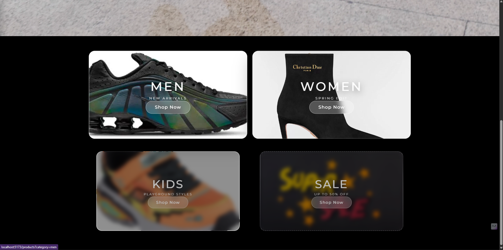
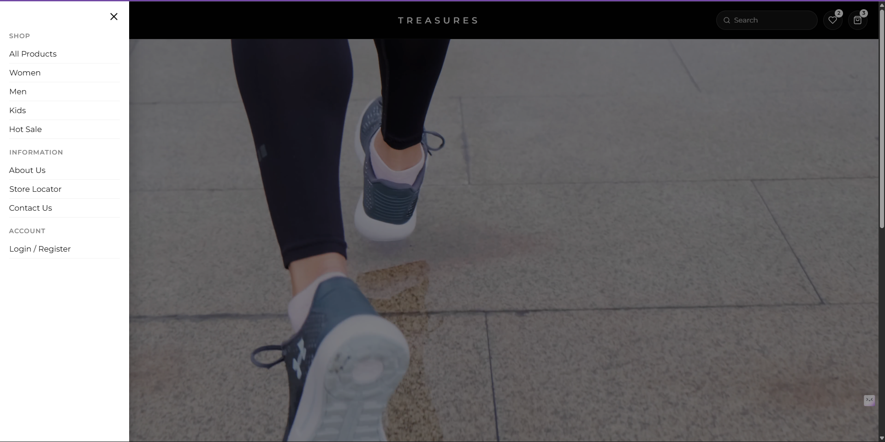
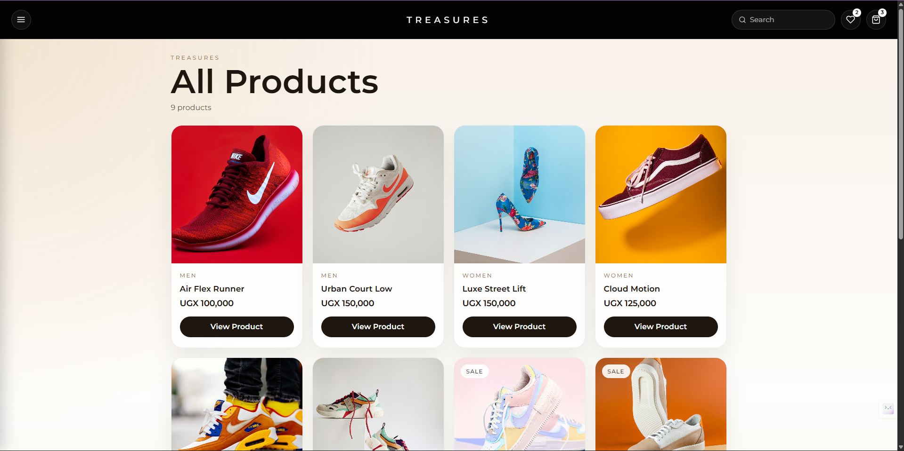

# Shoe Store Project

A modern, fully responsive e-commerce web application built using React.

## 🚀 Features
- Full product catalog across categories (Men, Women, etc.)
- Dynamic product filtering
- Clean and modern UI design
- Responsive layout for mobile and desktop

## 🛠 Tech Stack
- React (JSX)
- CSS (Custom styling)
- JavaScript

## 📂 Project Structure
- /frontend → main app code
- Components for reusable UI

## 👨‍💻 Author
Jimmy Ssewankambo

## Screenshots

### Homepage

### Hero Video Homepage

### Products Page

